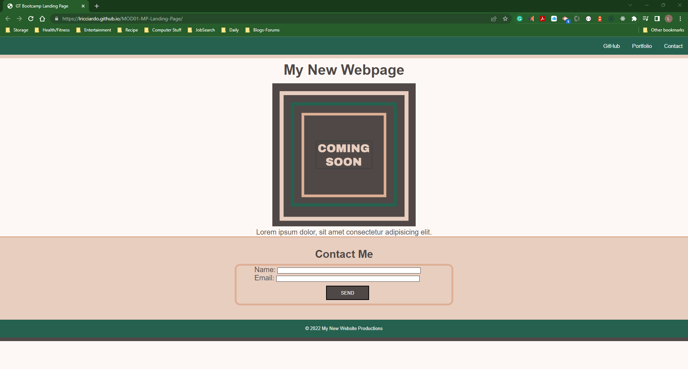

# <center><font color="blue">**Module 01 Mini-Project Landing Page**</font></center>
Created a landing page using HTML and CSS. 

[](https://opensource.org/licenses/MIT)

© 2022 Trilogy Education Services, LLC, a 2U, Inc. brand. Confidential and Proprietary. All Rights Reserved.

## Description<center><font color="blue">**Description**</font></center>

Beginning coding bootcamp mini group activity

Shortcut to GitHub Page: https://lricciardo.github.io/MOD01-MP-Landing-Page/
Shortcut to GitHub Repo: https://github.com/LRicciardo/MOD01-MP-Landing-Page

## Table of Contents
  
- [User Story](#userstory)
- [Acceptance Criteria](#acceptance-criteria)
- [Installation](#installation)
- [Hints](#hints)
- [Usage](#usage)
- [Credits](#credits)
- [License](#license)
- [Feature](#features)
- [How to Contribute](#contribute)
- [How to Test](#test)
- [Contact Info](#contact) 

## User Story

```md
* As a client, I want to view a single webpage that collects a visitor's contact information.

* As a client, I want the landing page to have a header and footer.

* As a client, I want the landing page to have an image with a caption.

* As a client, I want the landing page to have a contact form.

* As a client, I want the landing page to have a polished and accessible UI.
```


## Acceptance Criteria

```md
* It's done when the page uses semantic HTML elements.

* It's done when the page uses universal, element, and class selectors in CSS.

* It's done when the page features at least three colors in the design.

* It's done when the page uses a single font and font family for all text.

* It's done when the page uses at least two heading elements (`<h1>` through `<h6>`).

* It's done when the header is fixed to the top of the page on scroll.

* It's done when the header contains a navigation bar with three links that display inline, including a contact link.

* It's done when, if the contact link is clicked, the page jumps directly to the contact form.

* It's done when the contact form includes `input` elements for name and email.

* It's done when the contact form includes a Send button.

* It's done when the image includes a descriptive `alt` attribute.

* It's done when the page is deployed to GitHub Pages.  
```

## Visual Documentation

The following is a Link to Deployed website from **Heroku**:


***

## Hints

💡 Refer to the documentation:

* [YouTube video on enabling GitHub Pages](https://youtu.be/P4Mu1t5rIXg)

* [MDN Web Docs on HTML elements](https://developer.mozilla.org/en-US/docs/Web/HTML/Element)

* [MDN Web Docs on color](https://developer.mozilla.org/en-US/docs/Web/CSS/color)

* [MDN Web Docs on font](https://developer.mozilla.org/en-US/docs/Web/CSS/font)

* [MDN Web Docs on HTML section heading elements](https://developer.mozilla.org/en-US/docs/Web/HTML/Element/Heading_Elements)

* [MDN Web Docs on how to structure a web form](https://developer.mozilla.org/en-US/docs/Learn/Forms/How_to_structure_a_web_form)

* [MDN Web Docs on the button element](https://developer.mozilla.org/en-US/docs/Web/HTML/Element/button)

* [MDN Web Docs on the figure element](https://developer.mozilla.org/en-US/docs/Web/HTML/Element/figure)

* [Full-Stack Blog HTML Cheatsheet](https://coding-boot-camp.github.io/full-stack/html/html-cheatsheet)

---

## Installation

none

## Usage
- HTML (HyperText Markup Language)
- CSS (Cascading Style Sheets)

## Credits

none

## License

This application is using the The MIT License License. Click on the badge  [](https://opensource.org/licenses/MIT)  to follow the link to the license.

---

## Features

none

## How to Contribute

This application follows the [Contributor Covenant](https://www.contributor-covenant.org/).

## Tests


  
## Contact Info

This application follows the [Contributor Covenant](https://www.contributor-covenant.org/).

If you would like to contact me about an issue, you can send an email to Liane.Ricciardo@gmail.com.

